# SwiftUILayout


this article refers SwiftUI [Layout Api](https://developer.apple.com/documentation/swiftui/layout-adjustments) apple layout example

For the content described in this article, by default you have some experience based on Swift language development, so it will not describe every detail in detail; if you have doubts about SwiftUI, you can see some example in this [SwiftUI](https://github.com/Jinxiansen/SwiftUI)

## 💻 Requirements

- macOS 10.15
- Xcode 11.0
- iOS 13.0

## 📂 Directory：
    
* <span id="Size">Size</span>
	- [frame](#frame)
	- [fixedSize](#fixedSize)
	- [layoutPriority](#layoutPriority)

* <span id="Position">Position</span>
	- [position](#position)
	- [offset](#offset)
	- [coordinateSpace](#coordinateSpace)

* <span id="Aligning views">Aligning views</span>
	- [AlignmentInStack](#AlignmentInStack)
	- [AlignmentAcrossStack](#AlignmentAcrossStack)
	- [AlignmentGuideHorizontal](#AlignmentGuideHorizontal)
	- [AlignmentGuideVertical](#AlignmentGuideVertical)

* <span id="Padding">Padding</span>
	- [paddingWithLength](#paddingWithLength)
	- [paddingWithEdge](#paddingWithEdge)
	- [paddingWithInsets](#paddingWithInsets)
    - [scenePaddingEdge](#scenePaddingEdge)
	- [scenePaddingWithScenePaddingEdge](#scenePaddingWithScenePaddingEdge)

* <span id="Grid">Grid</span>
	- [gridCellColumns](#gridCellColumns)
	- [gridCellAnchor](#gridCellAnchor)
	- [gridCellUnsizedAxesPage](#gridCellUnsizedAxesPage)
    - [gridColumnAlignment](#gridColumnAlignment)


* <span id="Layer Order">Layer Order</span>
	- [zIndex](#zIndex)

* <span id="Alignment">Alignment</span>
	- [AlignmentGallery](#AlignmentGallery)
	- [AlignmentTop](#AlignmentTop)
	- [AlignmentMiddle](#AlignmentMiddle)
	- [AlignmentBottom](#AlignmentBottom)
	- [FirstTextBaseLine](#FirstTextBaseLine)
	- [LastTextBaseLine](#LastTextBaseLine)

* <span id="View Implementations">View Implementations</span>
	- [opacity](#opacity)
	- [hidden](#hidden)


<h2 id="Size">Size</h2>
<h4 id="frame">frame</h4>
contains 2 method<br>
		
	//Positions this view within an invisible frame with the specified size.
	func frame(width: CGFloat,height: CGFloat,alignment: Alignment) -> some View<br>

	//Positions this view within an invisible frame having the specified size constraints.
	func frame(minWidth: CGFloat,idealWidth: CGFloat,maxWidth: CGFloat,minHeight: CGFloat,idealHeight: CGFloat,maxHeight: CGFloat,alignment: Alignment) -> some View

Example:

```swift
VStack{    
    Text("Hello, World!  w:100 h:100")
    	.frame(width: 100, height: 100)
    	.border(Color.blue)

   Text("Hello, World!  w:100 h:100")
        .frame(width: 100, height: 100, alignment:.leading)
        .border(Color.blue)
            
    Text("Hello, World!  w:100 h:100")
        .frame(minWidth: 20,idealWidth: 100, maxWidth: CGFloat.infinity,minHeight: 40,alignment: .leading)
        .border(Color.blue)
}
```

<details close>
  <summary>View running results</summary>
  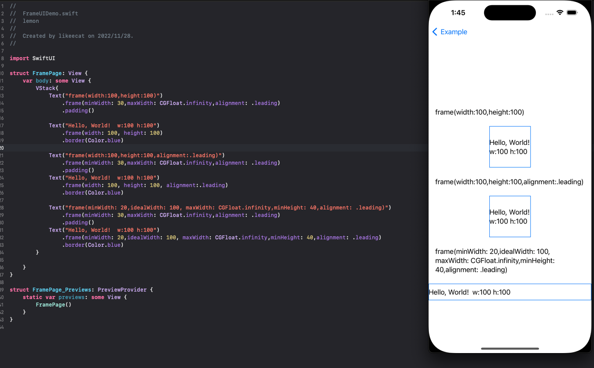
</details>

[🔝](#Size)

<h4 id="fixedSize">fixedSize</h4>
contains 2 method<br>

	//Fixes this view at its ideal size.
	func fixedSize() -> some View
	//Fixes this view at its ideal size in the specified dimensions.
	func fixedSize(horizontal: Bool,vertical: Bool) -> some View
Example:

```swift
VStack{    
    Text("A single line of text, too long to fit in a box.")
        .frame(width: 100, height: 100)
        .border(Color.gray)

    Text("A single line of text, too long to fit in a box.")
        .fixedSize()
        .frame(width: 100, height: 100)
        .border(Color.gray)

    Text("A single line of text, too long to fit in a box.")
        .fixedSize(horizontal: true, vertical: false)
        .frame(width: 100, height: 100)
        .border(Color.gray)
}
```

<details close>
  <summary>View running results</summary>
  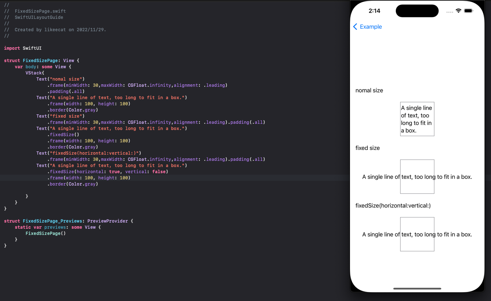
</details>

[🔝](#Size)


<h4 id="layoutPriority">layoutPriority</h4>
contains 1 method<br>

	//Sets the priority by which a parent layout should apportion space to this child.
	func layoutPriority(_ value: Double) -> some View
Example:

```swift
HStack {
    Text("This is a moderately long string.")
        .font(.largeTitle)
        .border(Color.gray)
            
    Spacer()
            
    Text("This is a higher priority string.")
        .font(.largeTitle)
        .layoutPriority(1)
        .border(Color.gray)
}
```

<details close>
  <summary>View running results</summary>
  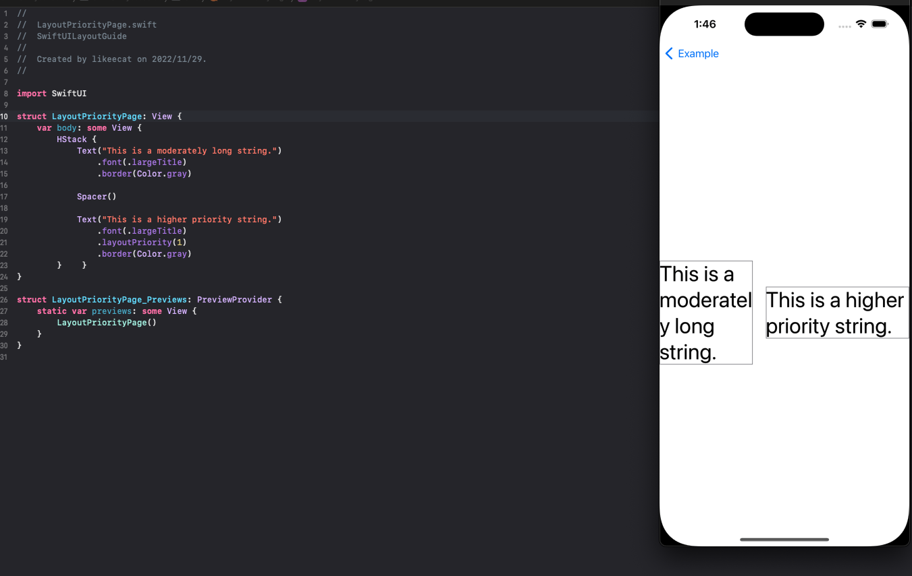
</details>

[🔝](#Size)


<h2 id="Position">Position</h2>
<h4 id="position">position</h4>
contains 2 method<br>
		
	//Positions the center of this view at the specified coordinates in its parent’s coordinate space.
	func position(x: CGFloat,y: CGFloat) -> some View
	//Positions the center of this view at the specified point in its parent’s coordinate space.
	func position(_ position: CGPoint) -> some View
Example:

```swift
VStack{
    Text("Position by passing the x and y coordinates")
        .position(x: 10, y: 100)
        .border(Color.gray)
    
	Spacer().frame(height: 50)

	Text("Position by passing a CGPoint()")
        .position(CGPoint(x: 10, y: 100))
        .border(Color.red)
}

```

<details close>
  <summary>View running results</summary>
  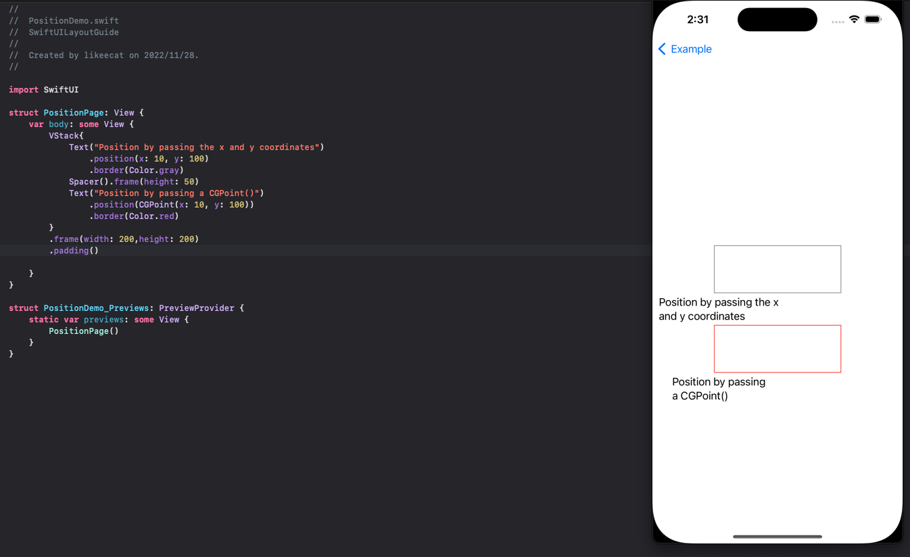
</details>

[🔝](#Size)

<h4 id="offset">offset</h4>
contains 2 method<br>
		
	//Offset this view by the horizontal and vertical amount specified in the offset parameter.
	func offset(_ offset: CGSize) -> some View
	//Offset this view by the horizontal and vertical amount specified in the offset parameter.
	func offset(_ offset: CGSize) -> some View
Example:

```swift
VStack{
	Text("Offset by passing horizontal & vertical distance")
        .border(Color.red)
        .offset(x: 20, y: 50)
        .border(Color.gray)
        
	Spacer().frame(height: 80)
    
	Text("Offset by passing CGSize()")
        .border(Color.green)
        .offset(CGSize(width: 20, height: 25))
        .border(Color.gray)
}
```

<details close>
  <summary>View running results</summary>
  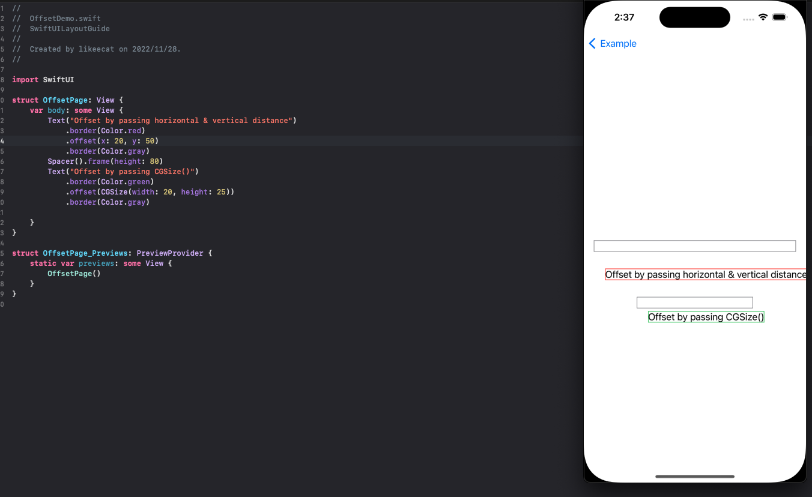
</details>

[🔝](#Size)

<h4 id="coordinateSpace">coordinateSpace</h4>
contains 1 method<br>
		
	//Assigns a name to the view’s coordinate space, so other code can operate on dimensions like points and sizes relative to the named space.
	func coordinateSpace<T>(name: T) -> some View where T : Hashable
Example:

```swift
struct CoordinateSpacePage: View {
    @State var location = CGPoint.zero
    
    var body: some View {
        VStack {
            Color.red.frame(width: 100, height: 100)
                .overlay(circle)
            Text("Location: \(Int(location.x)), \(Int(location.y))")
        }
        .coordinateSpace(name: "stack")
    }
    
    var circle: some View {
        Circle()
            .frame(width: 25, height: 25)
            .gesture(drag)
            .padding(5)
    }
    
    var drag: some Gesture {
        DragGesture(coordinateSpace: .named("stack"))
            .onChanged { info in location = info.location }
    }
}
```

<details close>
  <summary>View running results</summary>
  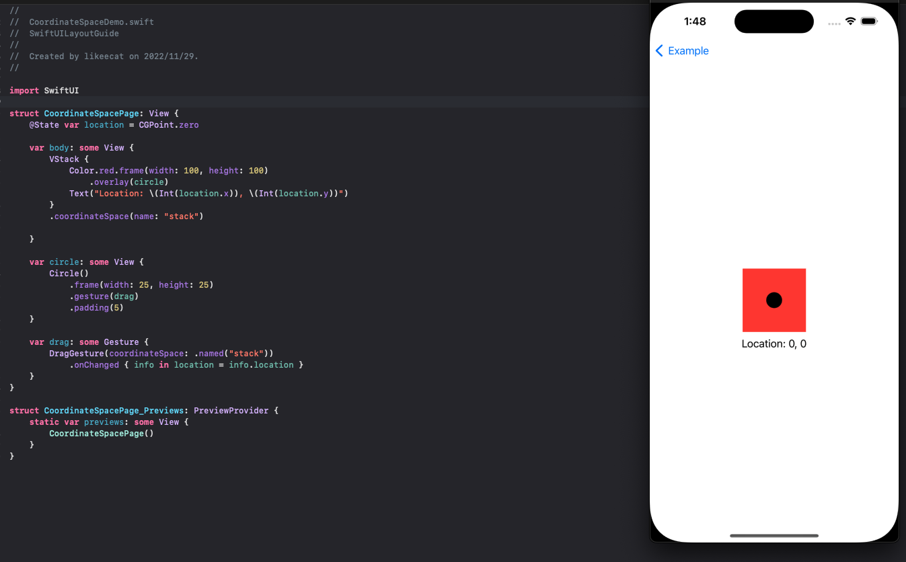
</details>

[🔝](#Size)

<h2 id="Aligning views">Aligning views</h2>
<h4 id="AlignmentInStack">AlignmentInStack</h4>
this is a guid page<br>
	
	//Position views inside a stack using alignment guides.
Example:

```swift
        VStack{
            // basic alignment(default)
            Text("basic alignment").frame(minWidth: 30,maxWidth: CGFloat.infinity,alignment: .leading).padding(.all)
            HStack {
                Image(systemName: "mic")
                Text("Connecting")
                    .font(.caption)
                Text("Bryan")
                    .font(.title)
            }.padding()
                .border(Color.blue, width: 1)
            
            Spacer().frame(minHeight: 10,maxHeight: 40)
            
            // firstTextBaseline
            Text("firstTextBaseline").frame(minWidth: 30,maxWidth: CGFloat.infinity,alignment: .leading).padding(.all)
            HStack(alignment: .firstTextBaseline) {
                Image(systemName: "mic")
                Text("Connecting")
                    .font(.caption)
                Text("Bryan")
                    .font(.title)
            }
            .padding()
            .border(Color.blue, width: 1)
            
            Spacer().frame(minHeight: 10,maxHeight: 40)
            
            //Adjust the alignment of individual views within a stack
            Text("adjust the alignment of individual views within a stack").frame(minWidth: 30,maxWidth: CGFloat.infinity,alignment: .leading).padding(.all)
            HStack(alignment: .firstTextBaseline) {
                Image(systemName: "mic")
                    .alignmentGuide(.firstTextBaseline) { context in
                        context[.bottom] - 0.5 * context.height
                    }
                Text("Connecting")
                    .font(.caption)
                Text("Bryan")
                    .font(.title)
            }.padding()
                .border(Color.blue, width: 1)


        }

```

<details close>
  <summary>View running results</summary>
  
</details>

[🔝](#Size)


<h4 id="AlignmentAcrossStack">AlignmentAcrossStack</h4>
this is a guid page<br>
		
	//Create a custom alignment and use it to align views across multiple stacks.

Example:

```swift
VStack{
            // basic alignment(default)
            Text("basic alignment").frame(minWidth: 30,maxWidth: CGFloat.infinity,alignment: .leading).padding(.all)
            HStack {
                VStack{
                    Image(systemName: "mic").frame(width: 50,height: 50)
                    Text("Bryan")
                        .font(.title)
                }.padding()
                    .border(Color.blue, width: 1)
                VStack{
                    Image(systemName: "mic").frame(width: 30,height: 30)
                    Text("Bryan")
                        .font(.title)
                }.padding()
                    .border(Color.blue, width: 1)

            }.padding()
                .border(Color.blue, width: 1)
            
            Spacer().frame(minHeight: 10,maxHeight: 40)
            
            // custom alignment(default)
            Text("custom alignment").frame(minWidth: 30,maxWidth: CGFloat.infinity,alignment: .leading).padding(.all)
            HStack(alignment: .imageTitleAlignmentGuide) {
                VStack{
                    Image(systemName: "mic").frame(width: 50,height: 50)
                    Text("Bryan")
                        .font(.title)
                }.padding()
                    .border(Color.blue, width: 1)
                VStack{
                    Image(systemName: "mic").frame(width: 30,height: 30)
                    Text("Bryan")
                        .font(.title)
                }.padding()
                    .border(Color.blue, width: 1)

            }.padding()
                .border(Color.blue, width: 1)
           
        }
```

<details close>
  <summary>View running results</summary>
  
</details>

[🔝](#Size)

<h4 id="AlignmentGuideHorizontal">AlignmentGuideHorizontal</h4>
contains 1 method<br>
		
	//Sets the view’s horizontal alignment.
	func alignmentGuide(_ g: HorizontalAlignment,computeValue: @escaping (ViewDimensions) ->CGFloat) -> some View
Example:

```swift
VStack {
    Text("Today's Weather")
        .font(.title)
        .border(.gray)
    HStack {
        Text("🌧")
        Text("Rain & Thunderstorms")
        Text("⛈")
    }
    .alignmentGuide(HorizontalAlignment.center) { _ in  50 }
    .border(.gray)
}
.border(.gray)
```

<details close>
  <summary>View running results</summary>
  
</details>

[🔝](#Size)


<h4 id="AlignmentGuideVertical">AlignmentGuideVertical</h4>
contains 1 method<br>
		
	//Sets the view’s vertical alignment.
	func alignmentGuide(_ g: VerticalAlignment,computeValue: @escaping (ViewDimensions) ->CGFloat) -> some View
Example:

```swift
VStack {
    Text("Today's Weather")
        .font(.title)
        .border(.gray)
            
    HStack {
        Text("🌧")
        	.alignmentGuide(VerticalAlignment.center) { _ in -20 }
        	.border(.gray)
        Text("Rain & Thunderstorms")
            .border(.gray)
        Text("⛈")
            .alignmentGuide(VerticalAlignment.center) { _ in 20 }
            .border(.gray)
    }
}
```

<details close>
  <summary>View running results</summary>
  
</details>

[🔝](#Size)


<h2 id="Size">Padding</h2>
<h4 id="paddingWithLength">paddingWithLength</h4>
contains 1 method<br>
		
	//Adds a specific padding amount to each edge of this view.
	func padding(_ length: CGFloat) -> some View

Example:

```swift
VStack {
    Text("Text padded by 10 points on each edge.")
        .padding(10)
        .border(.gray)
    Text("Unpadded text for comparison.")
        .border(.yellow)
}

```

<details close>
  <summary>View running results</summary>
  
</details>

[🔝](#Size)

<h4 id="paddingWithEdge">paddingWithEdge</h4>
contains 1 method<br>
		
	//Adds an equal padding amount to specific edges of this view.
	func padding(_ edges: Edge.Set = .all,_ length: CGFloat? = nil) -> some View


Example:

```swift
VStack {
    Text("Text padded by 20 points on the bottom and trailing edges.")
        .padding([.bottom, .trailing], 20)
        .border(.gray)
    Text("Unpadded text for comparison.")
        .border(.yellow)
}
```

<details close>
  <summary>View running results</summary>
  
</details>

[🔝](#Size)

<h4 id="paddingWithInsets">paddingWithInsets</h4>
contains 1 method<br>
		
	//Adds a different padding amount to each edge of this view.
	func padding(_ insets: EdgeInsets) -> some View
Example:

```swift
VStack {
    Text("Text padded by different amounts on each edge.")
        .padding(EdgeInsets(top: 10, leading: 20, bottom: 40, trailing: 0))
        .border(.gray)
    Text("Unpadded text for comparison.")
        .border(.yellow)
}

```

<details close>
  <summary>View running results</summary>
  
</details>

[🔝](#Size)

<h4 id="scenePaddingEdge">scenePaddingEdge</h4>
contains 1 method<br>
		
	//Adds padding to the specified edges of this view using an amount that’s appropriate for the current scene.
	func scenePadding(_ edges: Edge.Set = .all) -> some View
Example:

```swift
VStack(alignment: .leading, spacing: 10) {
    Text("Scene padding")
        .scenePadding(.horizontal)
        .border(.red) // Border added for reference.
    Text("Regular padding")
        .padding(.horizontal)
        .border(.green)
    Text("Text with no padding")
        .border(.blue)
    Button("Button") { }
}

```

<details close>
  <summary>View running results</summary>
  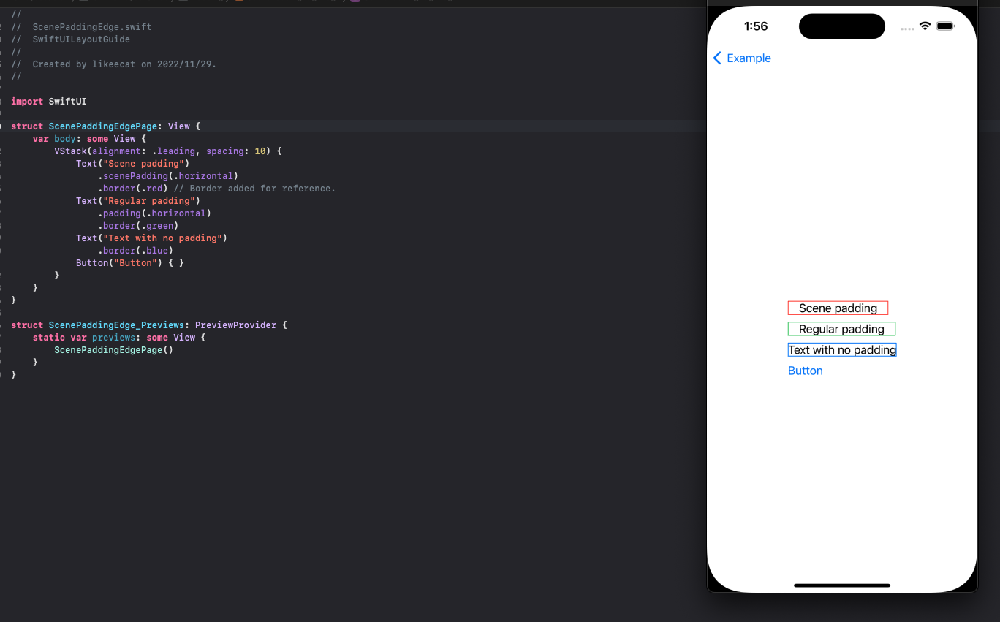
</details>

[🔝](#Size)

<h4 id="scenePaddingWithScenePaddingEdge">scenePaddingWithScenePaddingEdge</h4>
contains 1 method<br>
		
	//Adds a specified kind of padding to the specified edges of this view using an amount that’s appropriate for the current scene.
	func scenePadding(_ padding: ScenePadding,edges: Edge.Set = .all) -> some View
Example:

```swift
VStack(alignment: .leading, spacing: 10) {
    Text("Minimum Scene padding")
        .scenePadding(.minimum, edges: .horizontal)
        .border(.red) // Border added for reference.
    Text("Regular padding")
        .padding(.horizontal)
        .border(.green)
    Text("Text with no padding")
        .border(.blue)
    Button("Button") { }
}
```

<details close>
  <summary>View running results</summary>
  
</details>

[🔝](#Size)

<h2 id="Grid">Grid</h2>
<h4 id="gridCellColumns">gridCellColumns</h4>
contains 1 method<br>
		
	//Tells a view that acts as a cell in a grid to span the specified number of columns.
	func gridCellColumns(_ count: Int) -> some View
Example:

```swift
Grid(alignment: .leadingFirstTextBaseline) {
    GridRow {
        Text("Regular font:")
        Text("Helvetica 12").border(.red).padding()
        Button("Select") { }
    }
    GridRow {
        Text("Fixed-width font:")
        Text("Menlo Regular 11").border(.red).padding()
        Button("Select") { }
    }
    GridRow {
        Color.clear
            .gridCellUnsizedAxes([.vertical, .horizontal])
        Text("Use fixed-width font for new documents")
            .gridCellColumns(2).border(.red).padding() // Span two columns.
    }
}.border(.blue)
```

<details close>
  <summary>View running results</summary>
  
</details>

[🔝](#Size)

<h4 id="gridCellAnchor">gridCellAnchor</h4>
contains 1 method<br>
		
	//Specifies a custom alignment anchor for a view that acts as a grid cell.
	func gridCellAnchor(_ anchor: UnitPoint) -> some View
Example:

```swift
        VStack{
            Text("UnitPoint x: 0.25, y: 0.75").frame(minWidth: 30,maxWidth: CGFloat.infinity,alignment: .leading).padding(.all)
            Grid(horizontalSpacing: 1, verticalSpacing: 1) {
                GridRow {
                    Color.red.frame(width: 60, height: 60)
                    Color.red.frame(width: 60, height: 60)
                }
                GridRow {
                    Color.red.frame(width: 60, height: 60)
                    Color.blue.frame(width: 10, height: 10)
                        .gridCellAnchor(UnitPoint(x: 0.25, y: 0.75))
                }
            }
            
            Text(".topTrailing").frame(minWidth: 30,maxWidth: CGFloat.infinity,alignment: .leading).padding(.all)
            Grid(horizontalSpacing: 1, verticalSpacing: 1) {
                GridRow {
                    Color.red.frame(width: 60, height: 60)
                    Color.red.frame(width: 60, height: 60)
                }
                GridRow {
                    Color.red.frame(width: 60, height: 60)
                    Color.blue.frame(width: 10, height: 10)
                        .gridCellAnchor(.topTrailing)
                }
            }
            
            (Text(".center") + Text(" use gridCellColumns  for merged cells").font(.caption)).frame(minWidth: 30,maxWidth: CGFloat.infinity,alignment: .leading).padding(.all)
            Grid(alignment: .center, horizontalSpacing: 1, verticalSpacing: 1) {
                GridRow {
                    Color.red.frame(width: 60, height: 60)
                    Color.red.frame(width: 60, height: 60)
                    Color.red.frame(width: 60, height: 60)
                }
                GridRow {
                    Color.red.frame(width: 60, height: 60)
                    Color.blue.frame(width: 10, height: 10)
                        .gridCellColumns(2)
                }
            }
        }
```

<details close>
  <summary>View running results</summary>
  
</details>

[🔝](#Size)


<h4 id="gridCellUnsizedAxesPage">gridCellUnsizedAxesPage</h4>
contains 1 method<br>
		
	//Asks grid layouts not to offer the view extra size in the specified axes.
	func gridCellUnsizedAxes(_ axes: Axis.Set) -> some View
Example:

```swift
VStack{
    Grid {
        GridRow {
            Text("Hello")
            Image(systemName: "globe")
        }
        Divider()
        GridRow {
            Image(systemName: "hand.wave")
            Text("World")
        }
    }.border(.blue)

    Grid {
        GridRow {
            Text("Hello")
            Image(systemName: "globe")
        }
        Divider().gridCellUnsizedAxes(.horizontal)
        GridRow {
            Image(systemName: "hand.wave")
            Text("World")
        }
    }.border(.blue)
}
```

<details close>
  <summary>View running results</summary>
  
</details>

[🔝](#Size)


<h4 id="gridColumnAlignment">gridColumnAlignment</h4>
contains 1 method<br>
		
	//Overrides the default horizontal alignment of the grid column that the view appears in.
	func gridColumnAlignment(_ guide: HorizontalAlignment) -> some View
Example:

```swift
Grid(alignment: .leadingFirstTextBaseline) {
    GridRow {
        Text("Regular font:").gridColumnAlignment(.trailing).border(.blue).padding()
        Text("Helvetica 12")
        Button("Select") { }
    }
    GridRow {
        Text("Fixed-width font:").border(.blue).padding()
        Text("Menlo Regular 11")
        Button("Select") { }
    }
}
```

<details close>
  <summary>View running results</summary>
  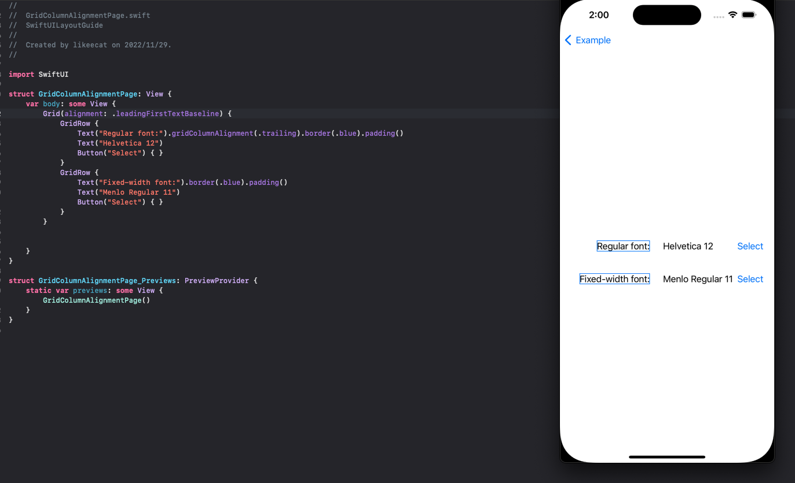
</details>

[🔝](#Size)

<h2 id="Layer Order">Layer Order</h2>
<h4 id="zIndex">zIndex</h4>
contains 1 method<br>
		
	//Controls the display order of overlapping views.
	func zIndex(_ value: Double) -> some View

Example:

```swift
VStack {
    Rectangle()
        .fill(Color.yellow)
        .frame(width: 100, height: 100, alignment: .center)
        .zIndex(1) // Top layer.
    
	Rectangle()
        .fill(Color.red)
        .frame(width: 100, height: 100, alignment: .center)
        .rotationEffect(.degrees(45))
}
```

<details close>
  <summary>View running results</summary>
  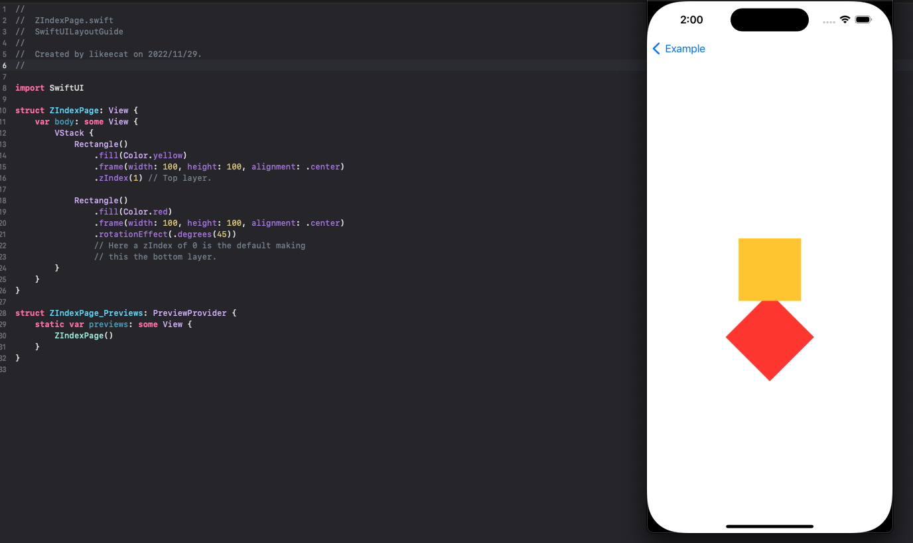
</details>

[🔝](#Size)

<h2 id="Alignment">Alignment</h2>
<h4 id="AlignmentGallery">AlignmentGallery</h4>
this is a guid page, contains all aligenment, next is the detail example<br>
	
	//An alignment in both axes.
Example:

```swift
struct AlignmentGalleryPage: View {
    var body: some View {
        BackgroundView()
            .overlay(alignment: .topLeading) { box(".topLeading") }
            .overlay(alignment: .top) { box(".top") }
            .overlay(alignment: .topTrailing) { box(".topTrailing") }
            .overlay(alignment: .leadingFirstTextBaseline) { box(".leadingFirst") }
            .overlay(alignment: .centerFirstTextBaseline) { box(".centerFirst") }
            .overlay(alignment: .trailingFirstTextBaseline) { box(".trailingFirst") }
            .overlay(alignment: .leading) { box(".leading") }
            .overlay(alignment: .center) { box(".center") }
            .overlay(alignment: .trailing) { box(".trailing") }
            .overlay(alignment: .bottomLeading) { box(".bottomLeading") }
            .overlay(alignment: .bottom) { box(".bottom") }
            .overlay(alignment: .bottomTrailing) { box(".bottomTrailing") }
            .overlay(alignment: .leadingLastTextBaseline) { box(".leadingLast") }
            .overlay(alignment: .centerLastTextBaseline) { box(".centerLast") }
            .overlay(alignment: .trailingLastTextBaseline) { box(".trailingLast") }
    }

    private func box(_ name: String) -> some View {
        Text(name)
            .font(.system(.caption, design: .monospaced))
            .padding(2)
            .foregroundColor(.white)
            .background(.blue.opacity(0.8), in: Rectangle())
    }
}

struct BackgroundView: View {
    var body: some View {
        Grid(horizontalSpacing: 0, verticalSpacing: 0) {
            GridRow {
                Text("Some text in an upper quadrant")
                Color.gray.opacity(0.3)
            }
            GridRow {
                Color.gray.opacity(0.3)
                Text("More text in a lower quadrant")
            }
        }
        .aspectRatio(1, contentMode: .fit)
        .foregroundColor(.secondary)
        .border(.gray)
    }
}
```

<details close>
  <summary>View running results</summary>
  
</details>

[🔝](#Size)

<h4 id="AlignmentTop">AlignmentTop</h4>

Example:
```swift
    var body: some View {
        BackgroundView()
            .overlay(alignment: .topLeading) { box(".topLeading") }
            .overlay(alignment: .top) { box(".top") }
            .overlay(alignment: .topTrailing) { box(".topTrailing") }
    }
    
    private func box(_ name: String) -> some View {
        Text(name)
            .font(.system(.caption, design: .monospaced))
            .padding(2)
            .foregroundColor(.white)
            .background(.blue.opacity(0.8), in: Rectangle())
    }
```

<details close>
  <summary>View running results</summary>
  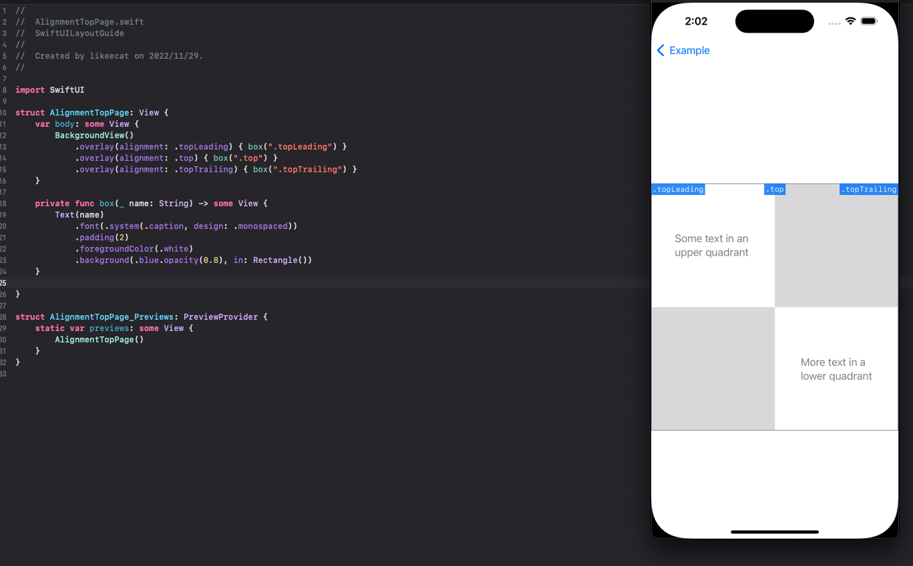
</details>

[🔝](#Size)


<h4 id="AlignmentMiddle">AlignmentMiddle</h4>

Example:
```swift
    var body: some View {
        BackgroundView()
            .overlay(alignment: .leading) { box(".leading") }
            .overlay(alignment: .center) { box(".center") }
            .overlay(alignment: .trailing) { box(".trailing") }
    }
    
    private func box(_ name: String) -> some View {
        Text(name)
            .font(.system(.caption, design: .monospaced))
            .padding(2)
            .foregroundColor(.white)
            .background(.blue.opacity(0.8), in: Rectangle())
    }
```

<details close>
  <summary>View running results</summary>
  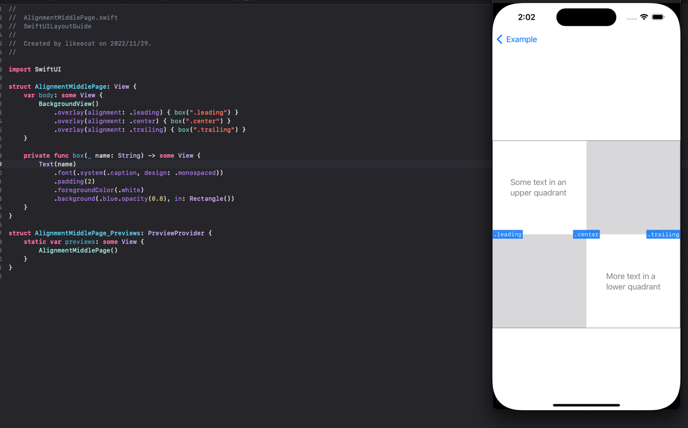
</details>

[🔝](#Size)

<h4 id="AlignmentBottom">AlignmentBottom</h4>

Example:
```swift
    var body: some View {
        BackgroundView()
            .overlay(alignment: .bottomLeading) { box(".bottomLeading") }
            .overlay(alignment: .bottom) { box(".bottom") }
            .overlay(alignment: .bottomTrailing) { box(".bottomTrailing") }
    }
    
    private func box(_ name: String) -> some View {
        Text(name)
            .font(.system(.caption, design: .monospaced))
            .padding(2)
            .foregroundColor(.white)
            .background(.blue.opacity(0.8), in: Rectangle())
    }
```

<details close>
  <summary>View running results</summary>
  
</details>

[🔝](#Size)

<h4 id="FirstTextBaseLine">FirstTextBaseLine</h4>

Example:
```swift
    var body: some View {
        BackgroundView()
            .overlay(alignment: .leadingFirstTextBaseline) { box(".leadingFirst") }
            .overlay(alignment: .centerFirstTextBaseline) { box(".centerFirst") }
            .overlay(alignment: .trailingFirstTextBaseline) { box(".trailingFirst") }
    }
    
    private func box(_ name: String) -> some View {
        Text(name)
            .font(.system(.caption, design: .monospaced))
            .padding(2)
            .foregroundColor(.white)
            .background(.blue.opacity(0.8), in: Rectangle())
    }
```

<details close>
  <summary>View running results</summary>
  
</details>

[🔝](#Size)


<h4 id="LastTextBaseLine">LastTextBaseLine</h4>

Example:
```swift
    var body: some View {
        BackgroundView()
            .overlay(alignment: .leadingLastTextBaseline) { box(".leadingLast") }
            .overlay(alignment: .centerLastTextBaseline) { box(".centerLast") }
            .overlay(alignment: .trailingLastTextBaseline) { box(".trailingLast") }
    }
    
    private func box(_ name: String) -> some View {
        Text(name)
            .font(.system(.caption, design: .monospaced))
            .padding(2)
            .foregroundColor(.white)
            .background(.blue.opacity(0.8), in: Rectangle())
    }
```

<details close>
  <summary>View running results</summary>
  
</details>

[🔝](#Size)

<h2 id="View Implementations">View Implementations</h2>
<h4 id="opacity">opacity</h4>
contains 1 method<br>
		
	//Sets the transparency of this view.
	func opacity(_ opacity: Double) -> some View
Example:

```swift
HStack{
    VStack {
        Color.yellow.frame(width: 100, height: 100, alignment: .center)
                    .zIndex(1)
        Color.red.frame(width: 100, height: 100, alignment: .center)
                    .padding(-40)
        Text("nomal").frame(width: 70,height: 50).padding(60)
    }
    
	VStack {
        Color.yellow.frame(width: 100, height: 100, alignment: .center)
                    .zIndex(1)
                    .opacity(0.5)
        Color.red.frame(width: 100, height: 100, alignment: .center)
                    .padding(-40)
        Text("set opacity").frame(width: 70,height: 50).padding(60)
    }
}

```

<details close>
  <summary>View running results</summary>
  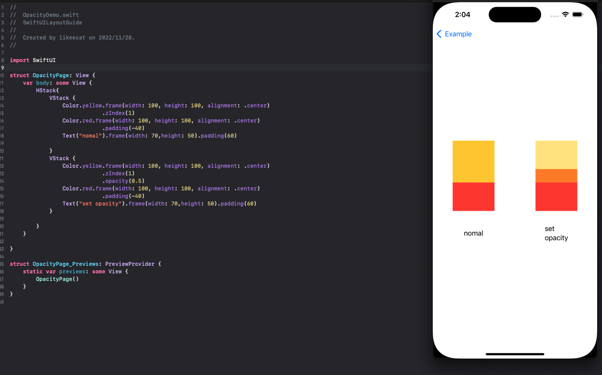
</details>

[🔝](#Size)

<h4 id="hidden">hidden</h4>
contains 1 method<br>
		
	//Hides this view unconditionally.
	func hidden() -> some View
Example:

```swift
        VStack{
            Text("nomal").frame(minWidth: 30,maxWidth: CGFloat.infinity,alignment: .leading).padding()

            HStack {
                Image(systemName: "a.circle.fill")
                Image(systemName: "b.circle.fill")
                Image(systemName: "c.circle.fill")
                Image(systemName: "d.circle.fill")
            }
            
            Divider()
            
            Text("set hidden").frame(minWidth: 30,maxWidth: CGFloat.infinity,alignment: .leading).padding()
            
            HStack {
                Image(systemName: "a.circle.fill")
                Image(systemName: "b.circle.fill")
                Image(systemName: "c.circle.fill")
                    .hidden()
                Image(systemName: "d.circle.fill")
            }
        }
```

<details close>
  <summary>View running results</summary>
  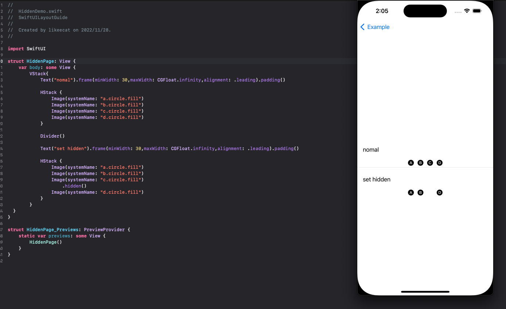
</details>

[🔝](#Size)

## 📎 About
- The code involved in the above example is in this repository code. It is recommended to download and run the view.
- If you have better usage and suggestions about SwiftUI, look forward to sharing it!
- If there are omissions and errors in the examples in this article, please create a Issue !

## ✉️ Contacts

email : maoyoushu@gmail.com

## 📄 License
SwiftUI is released under the [MIT license](LICENSE). See LICENSE for details.

